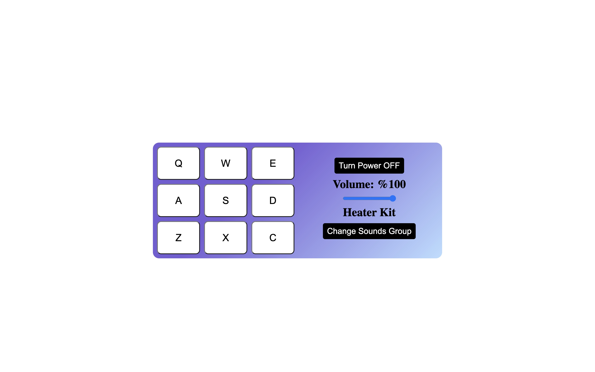

# Drum Machine

An App that works as a drum set of 9 pieces.

## Screenshots

## Demo

[Link](https://codepen.io/thepageguy/pen/MWZOgrj)

## Author

- [@thepageguy](https://www.github.com/thepageguy)

## Acknowledgement

- [FreeCodeCamp](https://www.freecodecamp.org/)

## Tech Stack

**Languages:** HTML5, CSS3 and React.js

## Features

- Working Drum set
- Change between two different sound effects
- Change volumen
- Turn On/Off
- Sound Effect on key press

## Lessons Learned

- Event Listeners
- Array of Object Iteration
- React useState

## Feedback

If you have any feedback, please reach out at thepageguy@mailfence.com.